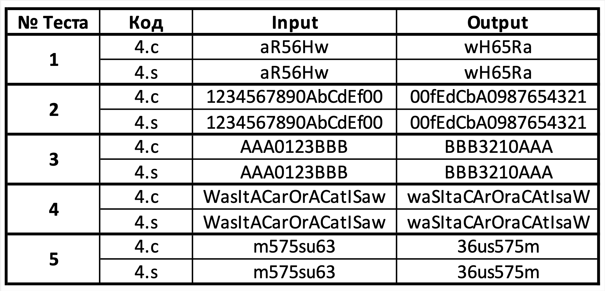
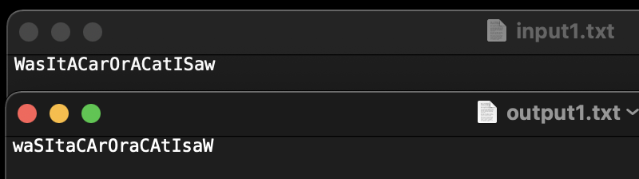
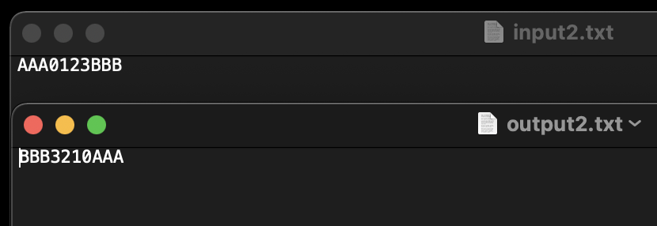

# HW_2
## Шаповалов Артём Сергеевич | БПИ-217 | Вариант 9

### Задание - 9 вариант:
Разработать программу, которая «переворачивает на месте» заданную ASCII-строку символов (не копируя строку в другой буфер).


### На 4 балла:
Решение на 4 балла на C - [4.c](4.c) 
<br>Программа на ассемблере на 4 балла, из которой убраны лишние макросы и добавлены комментариями  - [4.s](4.s) </br>

```
#include <stdio.h>
#include <stdlib.h>

char *get_string(int *len, int *check) {
    *len = 0; 
    *check = 0;
    int capacity = 1; 
    char *s = (char*) malloc(sizeof(char)); 
    char c = getchar();
    if(c > 127){
      (*check)++;
    }  
    while (c != '\n') {
        s[(*len)++] = c; 
        if (*len >= capacity) {
            capacity *= 2; 
            s = (char*) realloc(s, capacity * sizeof(char)); 
        }

        c = getchar();
	if(c > 127){
          (*check)++;
        }          
    }
    s[*len] = '\0'; 
    return s; 
}

int main() {
    int len, check; 
    char c;
    int counter;
    char *s = get_string(&len, &check);
    counter = len - 1;
    if(check == 0){
      for(int i = 0; i < len / 2;i++){
        c = s[i];
	s[i] = s[counter];
	s[counter] = c;
	counter = counter - 1;
      }
      printf("%s\n", s);
      return 0; 
    }
    else{
      printf("Incorrect input!");
      return 0;
    }
    free(s); 
    return 0;
}
```

Тесты и результаты:
<br ></br>

### На 5 баллов:

Решение на 5 баллов на С - [5.c](5.c)
<br> Программа на ассемблере на 5 баллов с соответстующими комментариями  - [5.s](5.s) </br>

char *get_string(int *len, int *test) - на вход подается длина строки и переменная, необходиммая для проверки правильности ввода.

<br>void reverse(char *s, int len) -  на вход подается указатель на строку и длина строки.</br>

```
#include <stdio.h>
#include <stdlib.h>

char *get_string(int *len, int *check) {
    *len = 0; 
    *check = 0;
    int capacity = 1; 
    char *s = (char*) malloc(sizeof(char)); 
    char c = getchar();
    if(c > 127){
      (*check)++;
    }  
    while (c != '\n') {
        s[(*len)++] = c; 
        if (*len >= capacity) {
            capacity *= 2; 
            s = (char*) realloc(s, capacity * sizeof(char)); 
        }

        c = getchar();
	if(c > 127){
          (*check)++;
        }          
    }
    s[*len] = '\0'; 
    return s; 
}
void reverse(char *s, int len){
  char c;
  int counter;
  counter = len - 1;
  for(int i = 0; i < len / 2;i++){
        c = s[i];
	s[i] = s[counter];
	s[counter] = c;
	counter = counter - 1;
  }
}

int main() {
    int len, check; 
    char *s = get_string(&len, &check); 
    if(check == 0){
      reverse(s, len);
      printf("%s", s);
      return 0; 
    }
    else{
      printf("Incorrect input!");
      return 0;
    } 
    free(s); 
    return 0;
}
```

### На 6 баллов:
Код программы был разделён на два файла, один из которых содержит основную программу - [6-1.s](6-1.s), а второй - функции - [6-2.s](6-2.s). 

[6.s](6.s) - программа с соответствующими комментариями, полученная в результате рефакторинга [5.s](5.s).

Прогон предыдущих тестов показал, что ответы получились одинаковые для всех программ, значит всё работает корректно.


### На 7 баллов:

Решение на 7 баллов на С - [7.c](7.c)
<br>Программа на ассемблере на 7 баллов с соответстующими комментариями  - [7.s](7.s) </br>

В программу были добавлены ввод и вывод с помощью файлов:
[input.txt](input.txt) - файл с входными данными
[output.txt](output.txt) - файл с выходными данными

Также реализована проверка ввода:

```
if(argc != 3){
      printf("Incorrect input!\n");
      return 0;
  }
  FILE *input = fopen(argv[1], "r");
  FILE *out = fopen(argv[2], "w");
  if((input == NULL) || (out == NULL)){
      printf("Incorrect file!\n");
      return 0;
  }
```

Тесты и результаты:
<br></br>
<br></br>


